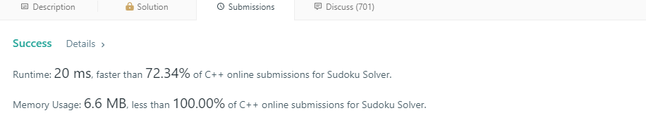

# SudokuSolver
Implementation of a SudokuSolver using a Stack for backtracking.

It was initially done for practising purposes at some point in 2018, when I was a second year student at UCLan Cyprus. This implementation was submitted in LeetCode on 19/05/2020, for a similar problem and it had scored quite well on both memory efficiency and speed.

